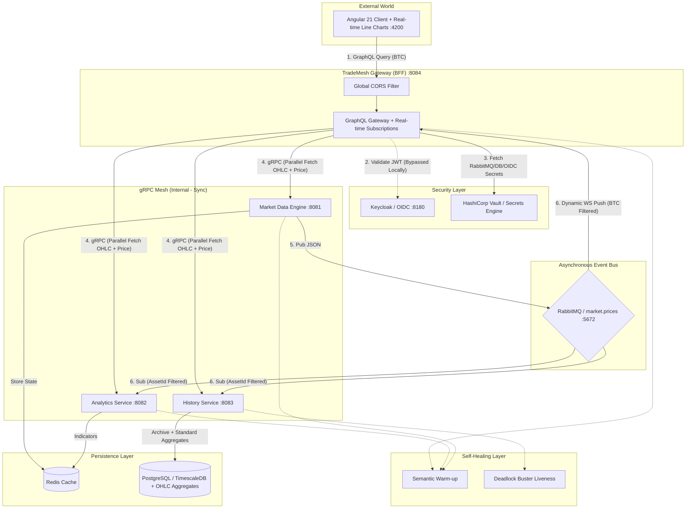

# TradeMesh — High-Performance Financial Data Mesh

TradeMesh is a cloud-native, real-time financial data platform designed specifically for **Red Hat OpenShift**. It leverages the power of **gRPC** for high-speed internal communication and **GraphQL** for a flexible API gateway experience.

## 🚀 Key Features
- **Real-time gRPC Mesh:** Low-latency communication between microservices using server-side streaming.
- **GraphQL API Gateway:** Unified entry point with parallel data fetching using **Java 21 Virtual Threads**.
- **Asynchronous Event Bus:** Real-time price distribution using **RabbitMQ**.
- **Time-Series Persistence:** Optimized storage using **PostgreSQL** (Standard Aggregates + TimescaleDB support).
- **Self-Healing Infrastructure:** Advanced Kubernetes probes (**Semantic Warm-up**, **Deadlock Buster**).
- **Security-First Design:** **HashiCorp Vault** for secrets management and **Keycloak** for OIDC.
- **Modern UI:** Angular 21 Dashboard with real-time **Line Charts** and data labels for Bitcoin.

## 🏗️ Architecture & Request Flow

The system follows the **Backend-for-Frontend (BFF)** pattern with a high-speed gRPC mesh and asynchronous event bus:



### Data Flow Lifecycle:
1. **Synchronous (BFF):** User loads the dashboard. Gateway fetches live data, indicators, and historical **OHLC** for BTC in parallel via gRPC using **Java 21 Virtual Threads**.
2. **Resilience:** Circuit Breakers trigger **Fallbacks** if backend services are slow or down.
3. **Asynchronous (Data Mesh):** Market Engine generates price ticks and broadcasts them to **RabbitMQ**.
4. **Real-time:** Gateway consumes RabbitMQ events and pushes them to the client via **GraphQL Subscriptions** (filtered by BTC).
5. **Security:** All production secrets are retrieved from **HashiCorp Vault** at runtime.
6. **Self-Healing:** **Database Deadlock Buster** and **Semantic Warm-up** ensure high availability.


## 🧪 Testing
To run tests across all services (requires Docker for DevServices):
```bash
# In headless environments (CLI/CI), use xvfb-run:
xvfb-run ./run_tests.sh
```

## 🚢 Deployment to Red Hat OpenShift
To deploy the entire stack (Infrastructure + Backend) automatically to your Red Hat Sandbox:
```bash
./deploy_to_openshift.sh
```
This script will:
- Verify your `oc login` status.
- Provision database and messaging via Terraform.
- Trigger OpenShift S2I builds for all backend microservices.
- Expose public Routes for the Gateway.
