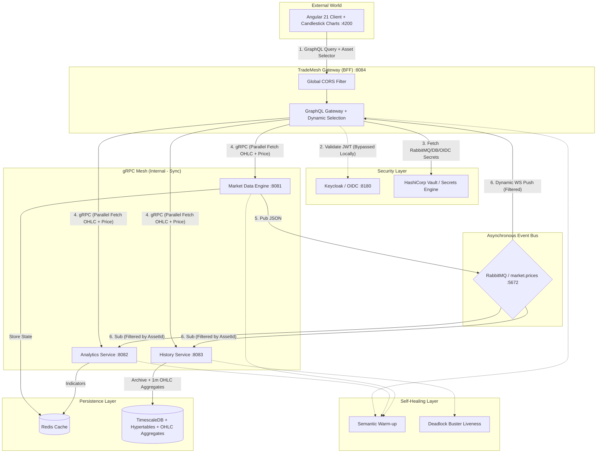

# TradeMesh — High-Performance Financial Data Mesh

TradeMesh is a cloud-native, real-time financial data platform designed specifically for **Red Hat OpenShift**. It leverages the power of **gRPC** for high-speed internal communication and **GraphQL** for a flexible API gateway experience.

## 🚀 Key Features
- **Real-time gRPC Mesh:** Low-latency communication between microservices using server-side streaming.
- **GraphQL API Gateway:** Unified entry point with parallel data fetching using **Java 21 Virtual Threads**.
- **Asynchronous Event Bus:** Real-time price distribution using **RabbitMQ**.
- **Time-Series Persistence:** Hyper-optimized storage using **TimescaleDB** (Hypertables + OHLC Aggregates).
- **Self-Healing Infrastructure:** Advanced Kubernetes probes (**Semantic Warm-up**, **Deadlock Buster**).
- **Security-First Design:** **HashiCorp Vault** for secrets management and **Keycloak** for OIDC.
- **Modern UI:** Angular 21 Dashboard with professional **Candlestick Charts** and dynamic asset selection.

## 🏗️ Architecture & Request Flow

The system follows the **Backend-for-Frontend (BFF)** pattern with a high-speed gRPC mesh and asynchronous event bus:



### Data Flow Lifecycle:
1. **Synchronous (BFF):** User requests an asset via GraphQL. Gateway fetches live data, indicators, and historical **OHLC** in parallel via gRPC using **Java 21 Virtual Threads** (`@RunOnVirtualThread`). Cross-origin requests are enabled via a **GlobalCorsFilter**.
2. **Resilience:** If any backend fails, **Circuit Breakers** trigger **Fallbacks**, ensuring partial data delivery.
3. **Asynchronous (Data Mesh):** Market Engine generates price ticks and broadcasts them to **RabbitMQ** as JSON.
4. **Real-time:** Gateway consumes RabbitMQ events as `JsonObject` and pushes them to the client via **GraphQL Subscriptions (WebSockets)**. The UI features a **Dynamic Asset Selector** for live candlestick updates.
5. **Security:** All production secrets (RabbitMQ, DB, Keycloak) are dynamically retrieved from **HashiCorp Vault** at runtime.
6. **Self-Healing:** Services implement **Semantic Warm-up** logic to ensure readiness. **Database Deadlock Buster** monitors connection pools in real-time, triggering automated Pod restarts via LivenessProbes if pool exhaustion is detected.


## 🧠 Logic & Testability
The system implements a **Separated Logic Layer** to ensure high reliability and fast feedback loops:
- **Core Algorithms:** Decoupled from framework-specific code (e.g., `SmaCalculator`, `PriceEngine`).
- **Entity Factories:** Isolated creation logic (e.g., `TransactionFactory`) for predictable JPA state.
- **Fast Feedback:** Business logic is verified via **Pure Unit Tests** (< 1s execution).

## ✅ Quality Assurance
The platform follows a rigorous testing strategy:
- **CI (GitHub):** Every push to `master` triggers a **GitHub Actions** pipeline to run full Unit and Integration test suites.
- **Headless Testing:** Frontend tests run in CI using **Xvfb (X Virtual FrameBuffer)** to simulate a display for Chrome.
- **Build & Deploy (OpenShift):** After successful CI, images are built internally on the Red Hat Sandbox using **BuildConfigs (S2I)**.
- **GitOps (ArgoCD):** Automates the synchronization of the environment state with the latest built images.

## 📡 gRPC Mesh Contracts
Located in `proto/`, these files define the "Source of Truth" for all communications.
- **`market.proto`**: Real-time market prices.
- **`analytics.proto`**: Technical indicators (RSI, MA).
- **`history.proto`**: Historical data and real OHLC Candlestick series.

---

## 🧪 Testing
To run tests across all services (requires Docker for DevServices):
```bash
# In headless environments (CLI/CI), use xvfb-run:
xvfb-run ./run_tests.sh
```

## 🛠️ Build & Compilation
To compile all services and generate gRPC/GraphQL sources:
```bash
for d in *-service; do (cd "$d" && ./mvnw compile -DskipTests); done
```

---
