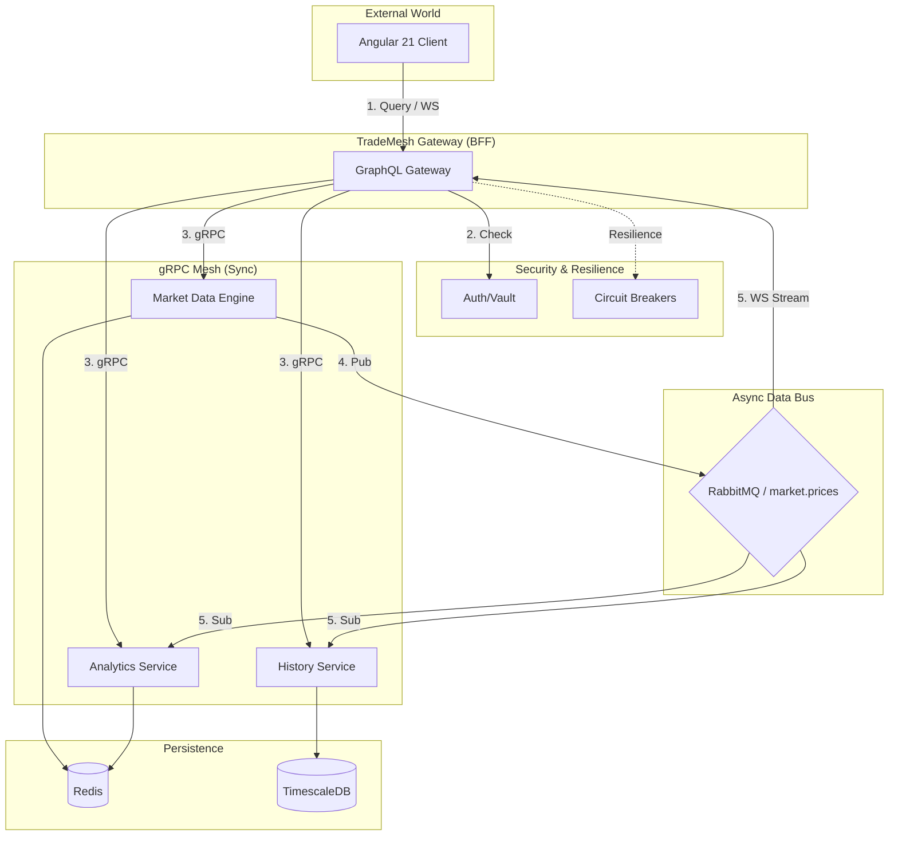

# TradeMesh Technical Core

This directory contains the implementation of the TradeMesh platform, structured into infrastructure, contracts, and Java 21 microservices.

## 📡 gRPC Mesh Contracts
Located in `proto/`, these files define the "Source of Truth" for all communications.
- **`market.proto`**: Real-time market prices.
- **`analytics.proto`**: Technical indicators (RSI, MA).
- **`history.proto`**: Historical data and OHLC Candlestick series.

## 🏗️ Architecture & Request Flow
The system follows the **Backend-for-Frontend (BFF)** pattern with a high-speed gRPC mesh and asynchronous event bus:



## 🧩 Microservices (Quarkus 3.15+)
Each service is built using Java 21 and the Mutiny reactive programming model.

1. **`gateway-service`**:
   - The BFF (Backend for Frontend).
   - Aggregates gRPC data using Virtual Threads.
   - Provides GraphQL Query & Subscription (WebSockets) API.
   - Resilience: Circuit Breakers & Fallbacks.

2. **`market-data-service`**:
   - Real-time market simulator.
   - Publishes price ticks to RabbitMQ (`market.prices` exchange).
   - Manages live state in Redis.

3. **`analytics-service`**:
   - Computes technical indicators (e.g., SMA).
   - Consumes live ticks from RabbitMQ.
   - Stores results in Redis.

4. **`history-service`**:
   - Time-series archival service.
   - Consumes live ticks from RabbitMQ.
   - Persists data into TimescaleDB (PostgreSQL).

## 🏗️ Core Infrastructure (Terraform)
Located in `infra/terraform/`, these files manage the foundation for the Red Hat OpenShift environment.
- `database.tf`: Provisions TimescaleDB and Redis.
- `messaging.tf`: Provisions RabbitMQ Cluster.
- `security.tf`: Provisions HashiCorp Vault.
- `iam.tf`: Provisions Keycloak.
- `main.tf`: Configures NetworkPolicies.

---

## 🛠️ Build & Compilation
To compile all services and generate gRPC/GraphQL sources:
```bash
for d in *-service; do (cd "$d" && ./mvnw compile -DskipTests); done
```

To package all services:
```bash
for d in *-service; do (cd "$d" && ./mvnw package -DskipTests); done
```
