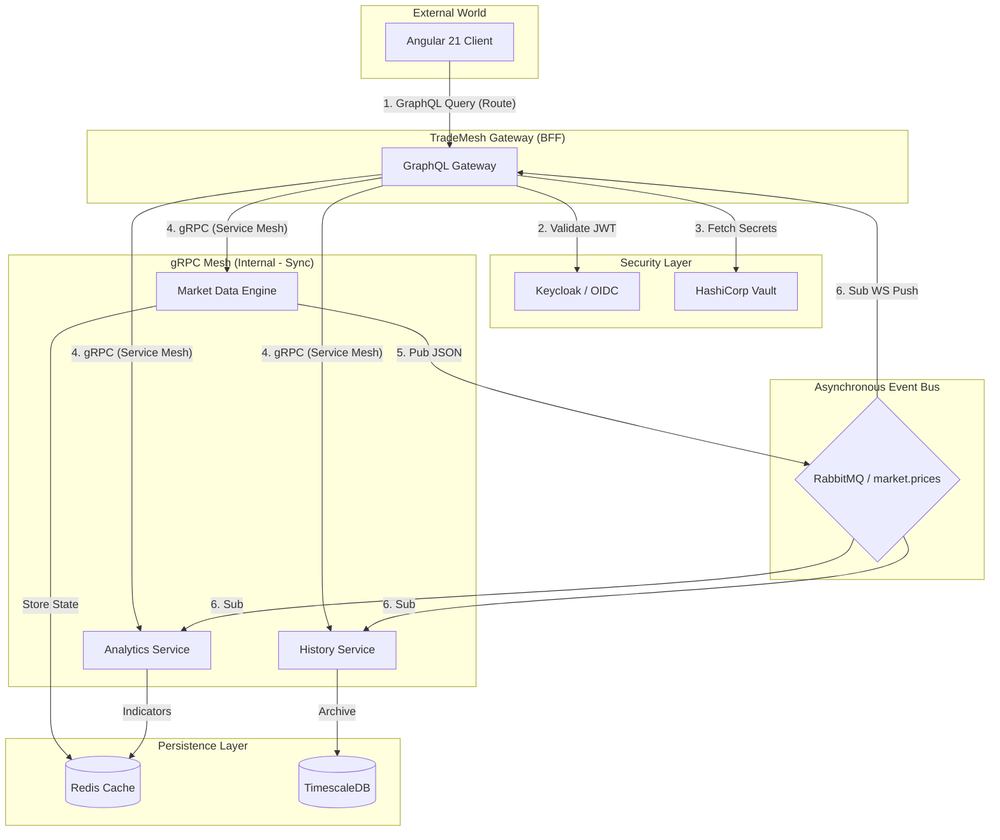

# TradeMesh — High-Performance Financial Data Mesh

TradeMesh is a cloud-native, real-time financial data platform designed specifically for **Red Hat OpenShift**. It leverages the power of **gRPC** for high-speed internal communication and **GraphQL** for a flexible API gateway experience.

## 🚀 Key Features
- **Real-time gRPC Mesh:** Low-latency communication between microservices using server-side streaming.
- **GraphQL API Gateway:** Unified entry point for external clients with parallel data fetching.
- **Asynchronous Event Bus:** Real-time price distribution using **RabbitMQ**.
- **Time-Series Persistence:** Hyper-optimized storage using **TimescaleDB** for historical market data.
- **Self-Healing Infrastructure:** Advanced Kubernetes probes (Semantic Warm-up, Deadlock Buster).
- **Security-First Design:** HashiCorp Vault for secrets management and Keycloak for IAM.

## 🏗️ Architecture & Request Flow

The system follows the **Backend-for-Frontend (BFF)** pattern with a high-speed gRPC mesh and asynchronous event bus:



### Data Flow Lifecycle:
1. **Synchronous (BFF):** User requests an asset via GraphQL. Gateway fetches live data, indicators, and history in parallel via gRPC using **Java 21 Virtual Threads**.
2. **Resilience:** If any backend fails, **Circuit Breakers** trigger **Fallbacks**, ensuring partial data delivery.
3. **Asynchronous (Data Mesh):** Market Engine generates price ticks and broadcasts them to **RabbitMQ**. 
4. **Real-time:** Gateway consumes RabbitMQ events and pushes them to the client via **WebSockets (GraphQL Subscriptions)**.
5. **Reliability:** Services implement **Semantic Warm-up** logic to ensure readiness before traffic ingestion.

## 🧠 Logic & Testability
The system implements a **Separated Logic Layer** to ensure high reliability and fast feedback loops:
- **Core Algorithms:** Decoupled from framework-specific code (e.g., `SmaCalculator`, `PriceEngine`).
- **Entity Factories:** Isolated creation logic (e.g., `TransactionFactory`) for predictable JPA state.
- **Fast Feedback:** Business logic is verified via **Pure Unit Tests** (< 1s execution).

## ✅ Quality Assurance
The platform follows a rigorous testing strategy:
- **CI (GitHub):** Every push to `master` triggers a **GitHub Actions** pipeline to run full Unit and Integration test suites. This ensures code quality before deployment.
- **Build & Deploy (OpenShift):** After successful CI, images are built **internally** on the Red Hat Sandbox using **BuildConfigs (S2I or Binary Builds)**. Images are stored in the OpenShift Internal Registry.
- **GitOps (ArgoCD):** Automates the synchronization of the environment state with the latest built images.
- **Contract Verification:** Ensures gRPC compatibility across the microservices mesh.

## 🧩 Microservices (Quarkus 3.15+)
Each service is built using Java 21 and the Mutiny reactive programming model.

1. **`gateway-service`**:
   - The BFF (Backend for Frontend).
   - Aggregates gRPC data using Virtual Threads.
   - Provides GraphQL Query & Subscription (WebSockets) API.
   - Resilience: Circuit Breakers & Fallbacks.

2. **`market-data-service`**:
   - Real-time market simulator.
   - Publishes price ticks to RabbitMQ (`market.prices` exchange).
   - Manages live state in Redis.

3. **`analytics-service`**:
   - Computes technical indicators (e.g., SMA).
   - Consumes live ticks from RabbitMQ.
   - Stores results in Redis.

4. **`history-service`**:
   - Time-series archival service.
   - Consumes live ticks from RabbitMQ.
   - Persists data into TimescaleDB (PostgreSQL).

## 📡 gRPC Mesh Contracts
Located in `proto/`, these files define the "Source of Truth" for all communications.
- **`market.proto`**: Real-time market prices.
- **`analytics.proto`**: Technical indicators (RSI, MA).
- **`history.proto`**: Historical data and OHLC Candlestick series.

## 🏗️ Core Infrastructure (Terraform)
Located in `infra/terraform/`, these files manage the foundation for the Red Hat OpenShift environment.
- `database.tf`: Provisions TimescaleDB and Redis.
- `messaging.tf`: Provisions RabbitMQ Cluster.
- `security.tf`: Provisions HashiCorp Vault.
- `iam.tf`: Provisions Keycloak.
- `main.tf`: Configures NetworkPolicies.

---

## 🧪 Testing
To run integration tests across all services (requires Docker for DevServices):
```bash
for d in *-service; do (cd "$d" && ./mvnw test -B); done
```

## 🛠️ Build & Compilation
To compile all services and generate gRPC/GraphQL sources:
```bash
for d in *-service; do (cd "$d" && ./mvnw compile -DskipTests); done
```

To package all services:
```bash
for d in *-service; do (cd "$d" && ./mvnw package -DskipTests); done
```

## 🛠️ Quick Start (Infrastructure)
1. Ensure you have `oc login` to your Red Hat Sandbox.
2. Navigate to `trade-mesh/infra/terraform/`.
3. Run `terraform init` and `terraform apply`.

---
